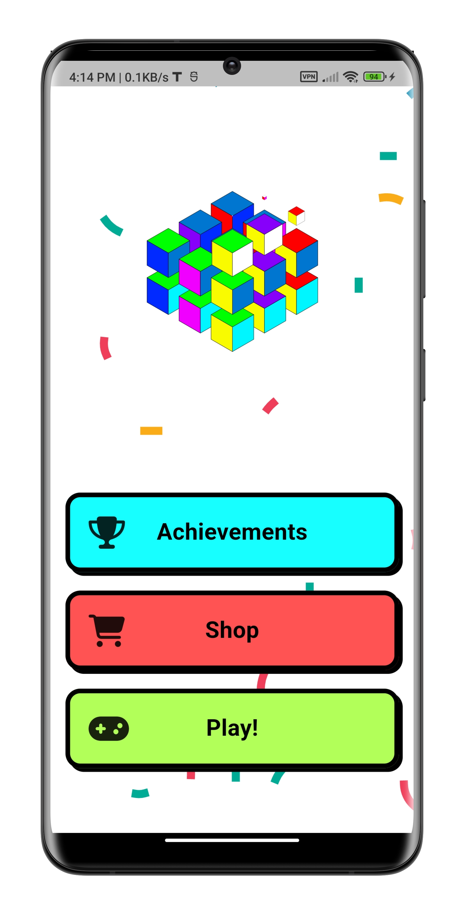
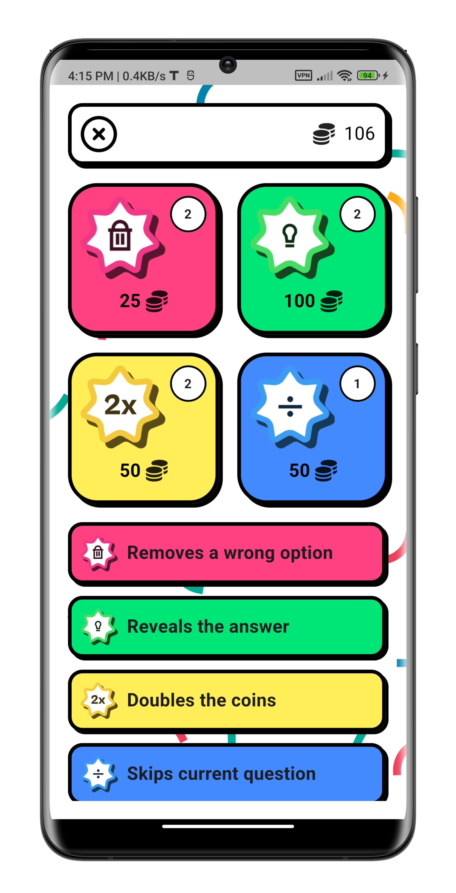
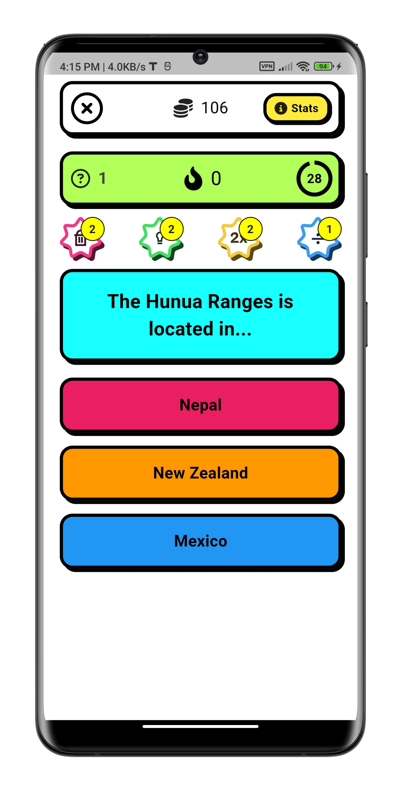
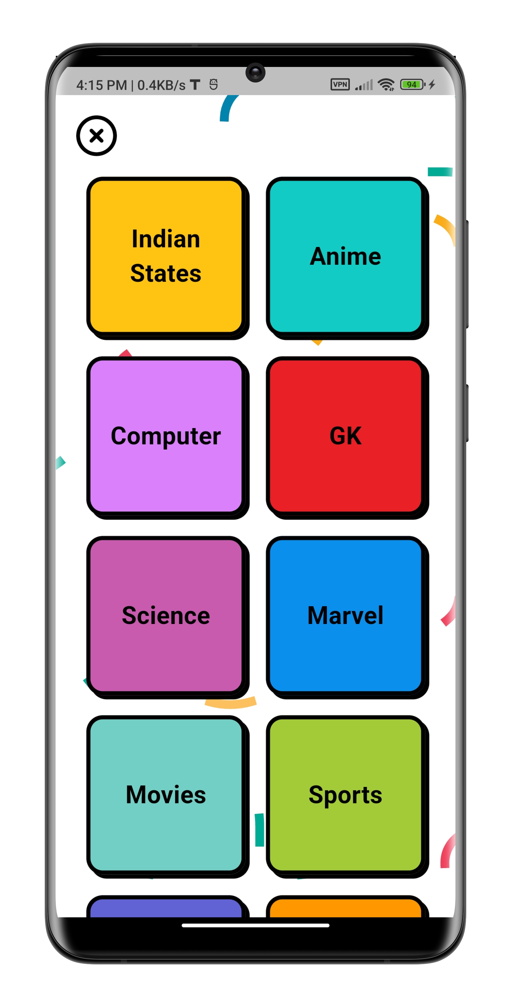
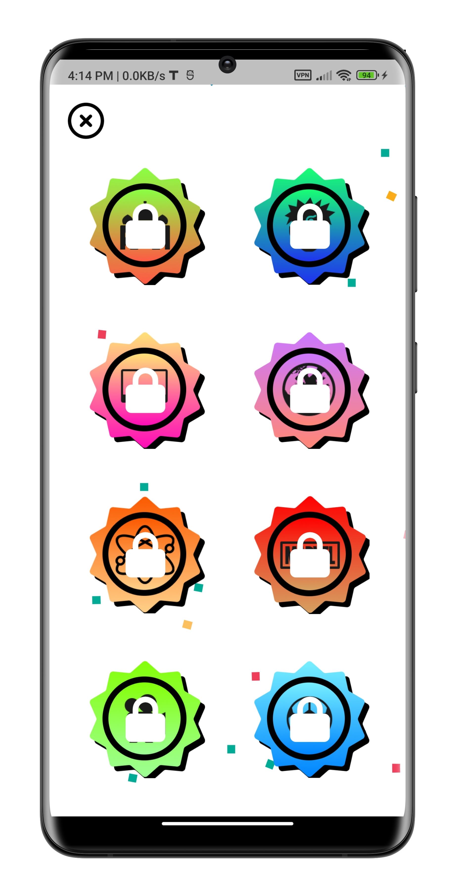
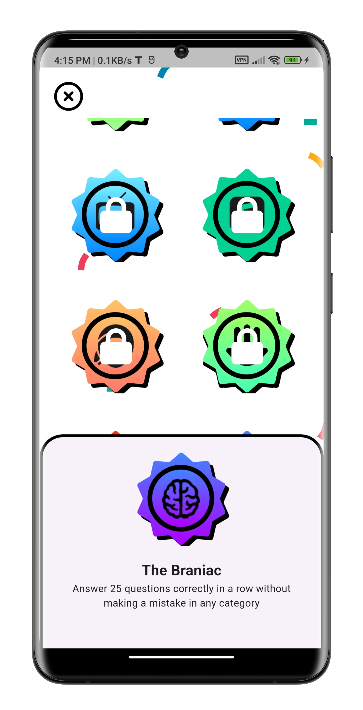
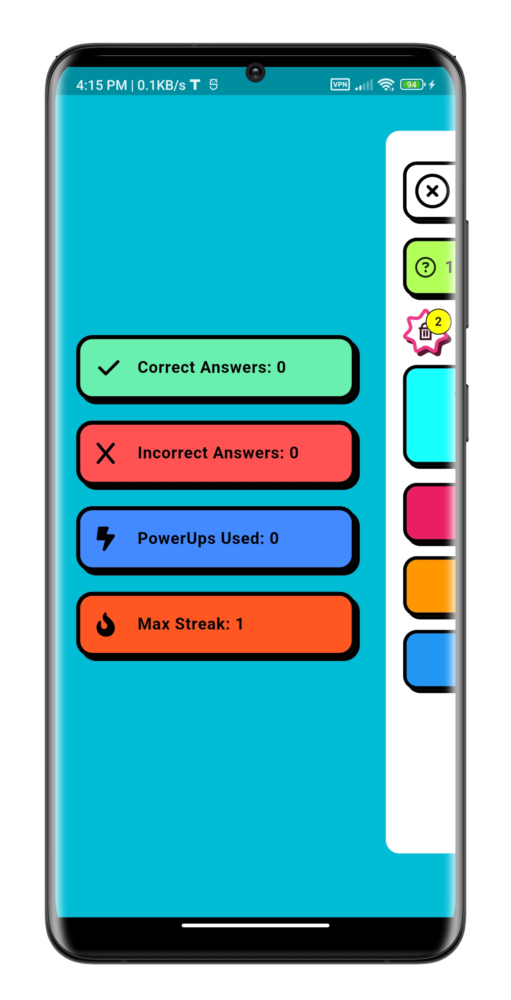

# Quiz 

A quiz app made with Flutter💙.

## Features
- Multiple Choise Questions
- 10 Categories of questions to choose from
- Point system
- Achievements / Badges
- PowerUps 
- Shop
- Beautiful Neubrutalistic design

## How it looks
<p align = "center">







</p>

## APK Release
- The latest version of the Flutter Quiz app can be found in the [Releases](https://github.com/jitesh117/QuizApp/releases) section of this GitHub repository. You can download the APK file for direct installation on your Android device.

- Please note that the APK release may not always be the most up-to-date version of the app. It is recommended to clone the repository and follow the installation instructions provided in the next section for the most recent version of the app.

### Installation
To install the APK on your Android device, follow these steps:

1. Download the APK file from the [Releases](https://github.com/jitesh117/QuizApp/releases) section.

1. Transfer the APK file to your Android device, either by connecting it to your computer or using a file-sharing method such as email or cloud storage.

1. On your Android device, navigate to the location of the APK file using a file manager app.

1. Tap on the APK file to start the installation process.

1. If prompted, enable the "Unknown sources" option in your device settings to allow the installation of apps from sources other than the Google Play Store.

1. Follow the on-screen instructions to complete the installation.

1. Once the installation is complete, you should be able to launch the Flutter Quiz app on your Android device and start using it. Enjoy the quiz experience!

## Run locally on your machine
```shell
git clone https://github.com/Jitesh117/QuizApp.git
```

```shell
cd QuizApp
```

```shell
flutter pub get
``` 

```shell
flutter run
```

## Acknowledgements
### Design 
- [Neubrutalist Quiz app - By Loidgi](https://www.figma.com/community/file/1145433435196546360)
- [Badges template](https://www.figma.com/community/file/1211091867838084867)
- [Icons8](https://icons8.com/)
### Flutter Packages
- [audioplayers](https://pub.dev/packages/audioplayers)
- [cirular_countdown_timer](https://pub.dev/packages/circular_countdown_timer)
- [confetti](https://pub.dev/packages/confetti)
- [draggable_bottom_sheet](https://pub.dev/packages/draggable_bottom_sheet)
- [flutter_advanced_drawer](https://pub.dev/packages/flutter_advanced_drawer)
- [font_awesome_flutter](https://pub.dev/packages/font_awesome_flutter)
- [lottie](https://pub.dev/packages/lottie)
- [provider](https://pub.dev/packages/provider)
- [shared_preferences](https://pub.dev/packages/shared_preferences)
- [shimmer_animation](https://pub.dev/packages/shimmer_animation)